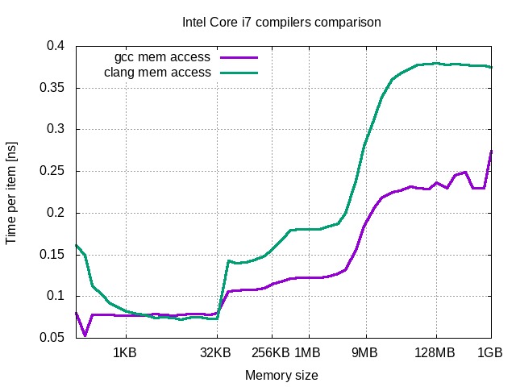
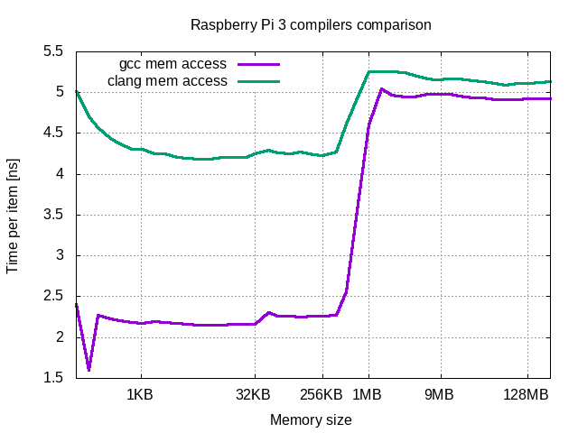

# Measuring memory performance

Project presents results of various memory benchmarks.
Benchmarks are done for processor cache (L1, L2, L3) and for RAM memory of code generated by gcc and clang compilers for Intel and ARM devices.


## Table of content

1. Experiments description and results
    1. [Experimets explanation](doc/README.md#experiments_exp)
    2. [Devices under benchmark](doc/README.md#devices)
        1. [Inter Core i7](doc/README.md#intel)
        2. [Raspberry Pi 3](doc/README.md#rpi)
    3. [Results per device](doc/README.md#results)
        1. *Inter Core i7*
            1. [Host](doc/i7/README.md#top)
                1. [Gcc](doc/i7/GCC.md#top)
                2. [Clang](doc/i7/CLANG.md#top)
                3. [Comparison between compilers](doc/i7/README.md#comparison)
                4. [Conclusions](doc/i7/README.md#conclusions)
            2. [VirtualBox](doc/i7_vbox_1/README.md#top)
                1. [Gcc](doc/i7_vbox_1/GCC.md#top)
                2. [Clang](doc/i7_vbox_1/CLANG.md#top)
                3. [Comparison between compilers](doc/i7_vbox_1/README.md#comparison)
                4. [Conclusions](doc/i7_vbox_1/README.md#conclusions)
        2. [Raspberry Pi 3](doc/rpi3/README.md#top)
            1. [Gcc](doc/rpi3/GCC.md#top)
            2. [Clang](doc/rpi3/CLANG.md#top)
            3. [Comparison between compilers](doc/rpi3/README.md#comparison)
            4. [Conclusions](doc/rpi3/README.md#conclusions)
2. [TL;DR](#tldr)
3. [Compilation and execution](#compilation)
4. [Requirements](#requirements)
5. [Techniques usage examples](#techniques)
6. [References](#references)


## <a name="tldr"></a>TL;DR

* gcc generates significantly faster code than clang
* there is almost no performance difference between *CPU* cache levels in comparison with *RAM*
* there is no difference in memory access timing between multi-threaded and multi-processed benchmarks
* there is no performance difference between single-threaded and multi-threaded benchmarks of linked list






## <a name="compilation"></a>Compilation and execution

To compile all exercises execute following sequence:
1. create build directory
2. go to build directory
3. configure: ```cmake -D CMAKE_BUILD_TYPE=Release /abs/path/to/src```
4. compile: ```make```
5. (optional) run tests by: ```ctest```
6. execute benchmarks, for example: ```./mem_performance/plot_all.sh --maxmem 1.6G```
7. examine results stored in directory ```./mem_performance/data```

Configuration can be done also by one of preconfigured scripts located in *configure* direcotry.


## Requirements

- C++ 14 standard supporting compiler
- CMake 3.1.1 or higher


## <a name="techniques"></a>Techniques usage examples

- inclusion of cmake's modules
- *gtest* integration as cmake external project
- configuration of code coverage for *gcc*
- configuration of *clang* sanitizer
- preparing data and plotting with *gnuplot*


## References

- *Googletest* testing framework [repository](https://github.com/google/googletest)
