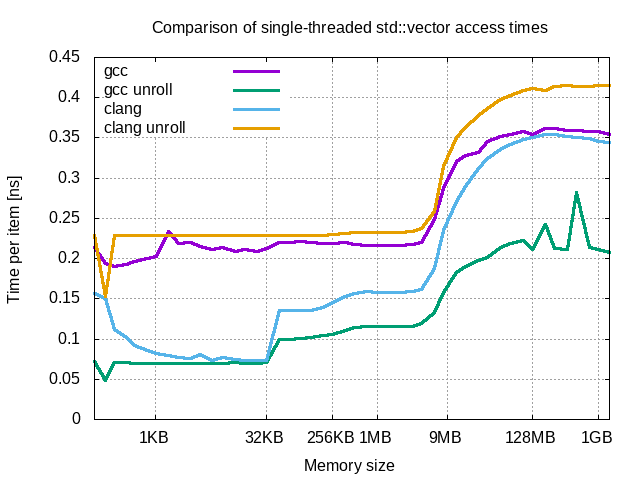

##  Comparison

### Cache influence on i7

Above chart presents preformance of std::vector under various compilations. Under *gcc unroll* and *clang* compilations there can be seen clear difference between cache levels, it is:
- *L1* cache up to 32 KB
- *L2* cache up to 256 KB
- *L3* cache up to 9 MB

*L1* cache is twice times faster than other cache levels.

In case of *gcc* and *clang unroll* there is no difference between cache levels.

Results of linked list shows significant benefits of using cache. For small lists (up to 128 KB) performance is simillar to std::vector. Beyond point of 2 MB performance highly depends on *RAM*. 

#### Impact on multiple threads and processes

Shape of presented curves is imillar to curves of single-threaded variants. The difference is in size-values of change points. For std::vector cache improves performance of containers of size up to 1 MB. For linked lists this container size limit is 16 KB.

### Cache influence on Raspberry Pi

Above chart presents preformance of std::vector under various compilations. There can be seen clear difference between cache and *RAM*, but difference between *L1* and *L2* is hard to notice.

Results of linked list shows significant benefits of using cache. Beyond cache size performance highly depends on *RAM*. 

#### Impact on multiple threads and processes

Shape of presented curves is imillar to curves of single-threaded variants. The difference is in size-values of change points. For std::vector cache improves performance of containers of size up to 256 KB. For linked lists this container size limit is 16 KB.

