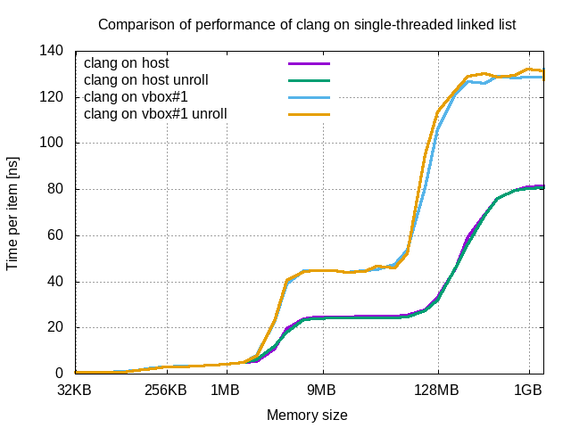
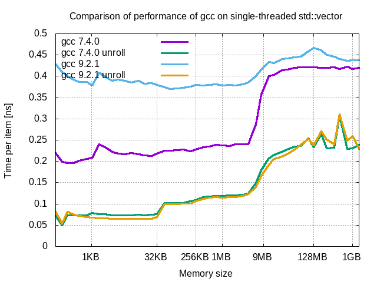
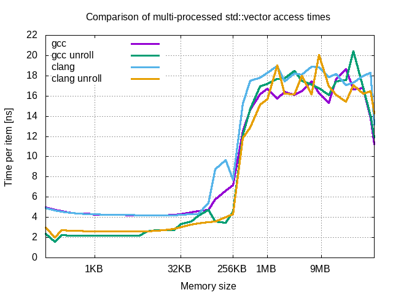

##  Comparison

### Performance cost of Virtual Box

Performance cost can be measured by comparing timing charts of experiments executed on host machine with results of experiments executed on virtualized environments.

The graphs shown present performance of std::vector and linked list on single thread under clang. Results of std::vector present no significant performance penalties for both: CPU cache and *RAM*. Situation changes on linked list. Beyond cache size there is increased use of *RAM*, so performance on virtual environment decreases. This observation leads to conclussion that on virtualized environment access to cache is costless, but access to *RAM* is burdened significantly.

### Comparison of compilers

Presented charts shows comparison of gcc and clang performing single-threaded and multi-threaded, std::vector and linked list exercises. The best performance achieves both versions of clang. They performs in similar manner. Then old version of gcc performs significantly slower. Worst performance presents new version of gcc.
Analyzing linked list experiments leads to similar conclusions. In addition when *RAM* goes into acount (beyond 1MB point) then difference in performance is marginal.

#### Loop unrolling

Above chart presents results for gcc compiler. Best performance is achieved for loop unrolling, independent for compiler version. Then for the same experiment, older version of gcc performs faster than newer version.

As seen on above chart, in general loop unrolling slows down code generated by clang compiler. Only for very small containers (up to 256B) unrolled loops of newer clang execute faster than other configurations. In addition there is no significant difference between code generated by clang versions without use of unrolling. 

Comparison of results of linked list experiments for all environments shows that loop unrolling does not affect performance of linked lists, because benefits are mitigated by cost of access to *RAM*.

### Cache influence on i7

Above chart presents preformance of std::vector under various compilations. Under *gcc unroll* and *clang* compilations there can be seen clear difference between cache levels, it is:
- *L1* cache up to 32 KB
- *L2* cache up to 256 KB
- *L3* cache up to 9 MB

*L1* cache is twice times faster than other cache levels.

In case of *gcc* and *clang unroll* there is no difference between cache levels.

Results of linked list shows significant benefits of using cache. For small lists (up to 128 KB) performance is similar to std::vector. Beyond point of 2 MB performance highly depends on *RAM*. 

#### Impact on multiple threads and processes

Shape of presented curves is similar to curves of single-threaded variants. The difference is in size-values of change points. For std::vector cache affects performance of containers of size up to 1 MB. For linked lists containers up to 2 MB are affected by cache.

### Cache influence on Raspberry Pi

Above chart presents preformance of std::vector under various compilations. There can be seen clear difference between cache and *RAM*, but difference between *L1* and *L2* is hard to notice.

Results of linked list shows significant benefits of using cache. Beyond cache size performance highly depends on *RAM*. 

#### Impact on multiple threads and processes

Shape of presented curves is similar to curves of single-threaded variants. The difference is in size-values of change points. For std::vector cache improves performance of containers of size up to 256 KB. For linked lists containers up to 1 MB are affected by cache.

