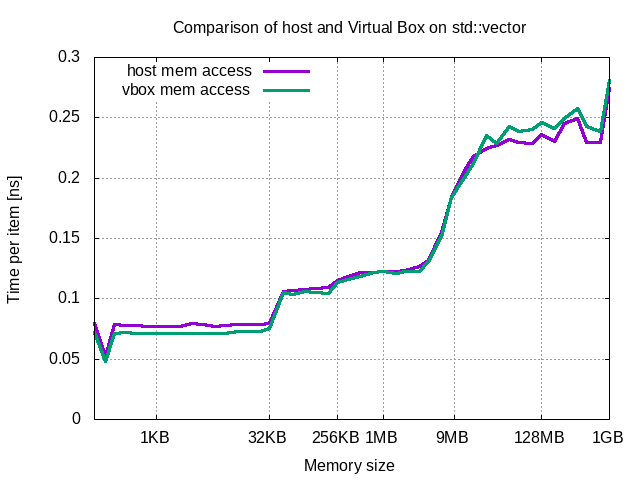
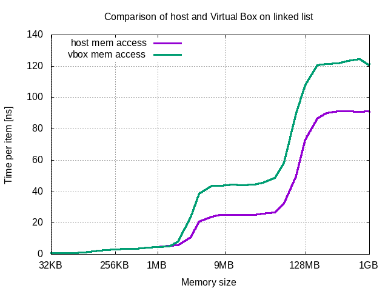

## Results per compiler

- [gcc](GCC.md#top)
- [clang](CLANG.md#top)

## Comparison with host environment

### single-threaded std::vector 

Chart presents comparison of efficiency of *CPU* cache on std::vector. As it can be seen, there is no difference between environments. This leads to conclussion that VirtualBox utilizes *CPU* cache without additional cost.

### single-threaded linked list

Chart presents comparison of efficiency of *RAM* on linked list. Performance of VBox until container size of 2MB is the same as for host -- it means *RAM* is not involved in execution. Beyond that point utilization of *RAM* rises. In this case virtualized environment performs significantly worse than host environment. It means VirtualBox utilizes physical memory with additional high cost.

## Conclusions

Presented comparison shows that there is no penalty in virtual environment related to cache -- it performs the same as in host environment. Situation changes in case of *RAM* access. In virtualized environment access time is up to two times longer than in native environment.

