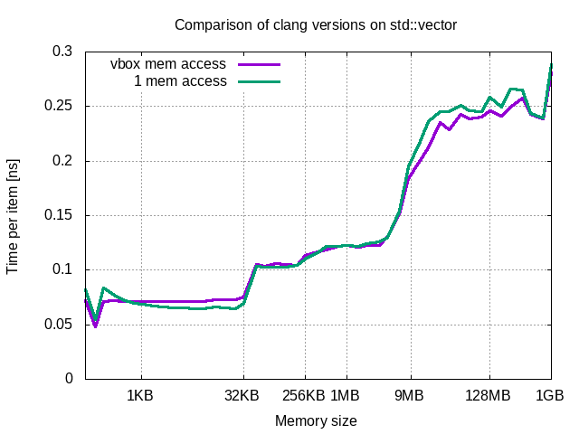

## Results per compiler

- [gcc](GCC.md#top)
- [clang](CLANG.md#top)

## Comparison between compiler versions

As seen on charts, there is only slight performance difference between compiler versions.

