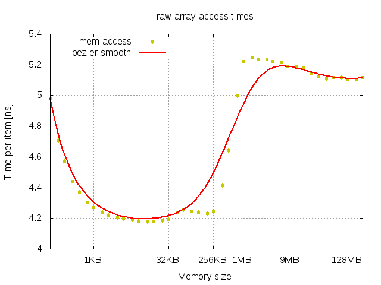
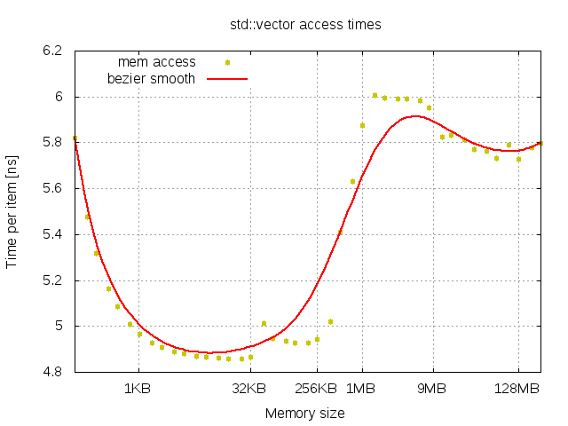
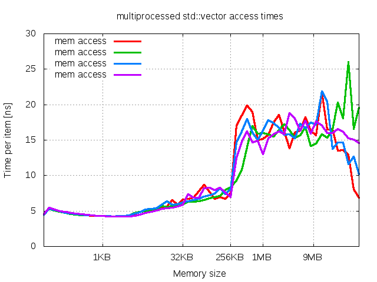
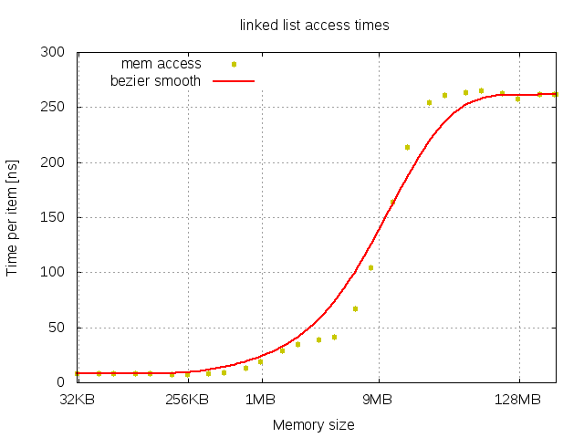
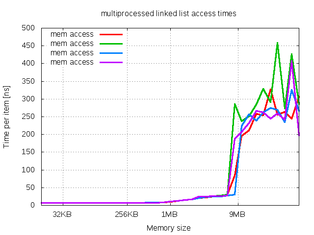

## single-threaded raw array

Performance of access time to raw array is presented in following image.

There are two plateau regions corresponding to levels of cache:
- *CPU* cache with access time around 4.2 ns per item in memory range between 1KB and 256KB
- *RAM* with access time around 5.1 ns per item in memory range starting from 1MB

There is slight difference in performance between *L1* and *L2* cache. In addition performance in range up to 2KB linearly increses from 5.0 ns to 4.2 ns.

## single-threaded std::vector

Performance chart and observations are similar to *single-threaded raw array* experiment. Timing difference is hard to notice.

## multi-threaded std::vector

Execution of this experiment is impossible due to clang's error in implementation of *std::thread*.

## multi-processed std::vector

In multi-processed experiment chart of std::vector exists two regions:
- region up to 32KB of container size
- region starting from 32KB

When container reaches 32KB of size there is gradual perfrmance loss up to 256KB and then dramatic loss up to 512KB due to increased cache coruption because of thread switching.

## single-threaded linked list

Performance chart demonstrates three regions:
1. constant timing of cache up to 512KB
2. linearly degrading timing of of *RAM* up to 4MB
3. constant worst performance of *RAM* beyond 32MB

Region no 2. and 3. in comparison with performance of *single-threaded std::vector* means existence of optimisations in access to *RAM* in case of sizes slightly greater than *CPU* cache. It could be sequential access to chunks of memory.

## multi-threaded linked list

Execution of this experiment is impossible due to clang's error in implementation of *std::thread*.

## multi-processed linked list

Performance chart and observations are similar to *single-threaded linked list* experiment. Timing difference is hard to notice.

## Conclusions

1. std::vector performs the same as raw array
2. there is no difference between *L1* and *L2* cache
4. there is no difference between results of single-threaded and multi-processed benchmarks of randomized linked list

