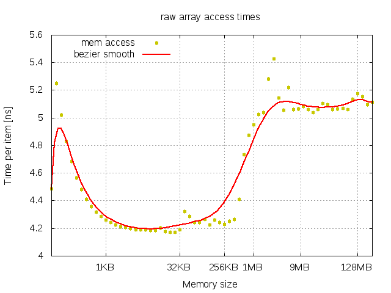
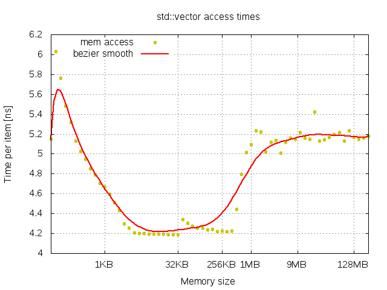
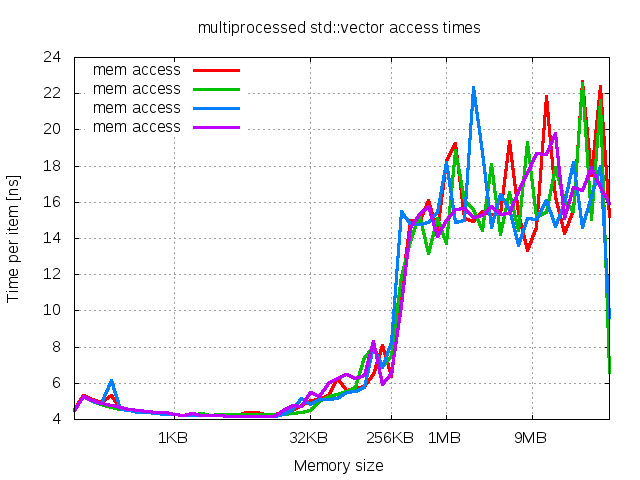
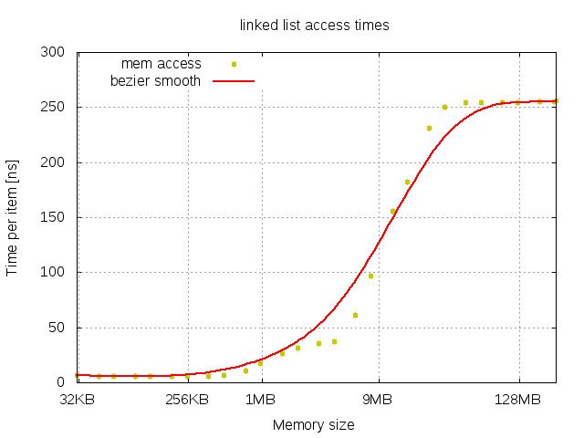
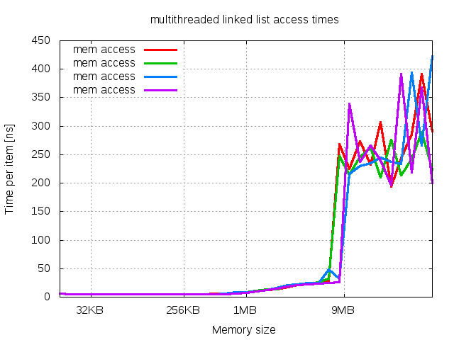
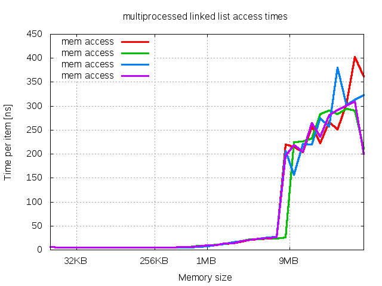

## single-threaded raw array

Performance of access time to raw array is presented in following image.

There are two plateau regions corresponding to levels of cache:
- *CPU* cache with access time around 2.2 ns per item in memory range up to 512KB
- *RAM* with access time around 4.9 ns per item in memory range starting from 1MB

In addition, there is no difference in performance between *L1* and *L2* cache.

## single-threaded std::vector

Performance chart and observations are similar to *single-threaded raw array* experiment. Timing difference is hard to notice.

## multi-threaded std::vector

In multi-threaded experiment chart of std::vector exists two regions:
- region up to 256KB of container size
- region starting from 256KB

When container reaches 256KB of size there is dramatic perfrmance loss due to increased cache coruption because of thread switching. Performance difference between *L1* and *L2* cache levels is marginal in comparison of inefficient timing of *RAM*. 

## multi-processed std::vector

Performance chart and observations are similar to *multi-threaded std::vector* experiment. Timing difference is hard to notice.

## single-threaded linked list

Performance chart demonstrates three regions:
1. constant timing of cache up to 512KB
2. linearly degrading timing of of *RAM* up to 4MB
3. constant worst performance of *RAM* beyond 32MB

Region no 2. and 3. in comparison with performance of *single-threaded std::vector* means existence of optimisations in access to *RAM* in case of sizes slightly greater than *CPU* cache. It could be sequential access to chunks of memory.

## multi-threaded linked list

Performance chart and observations are similar to *single-threaded linked list* experiment. It proofs no influence of *CPU* cache structures.

## multi-processed linked list

Performance chart and observations are similar to *multi-threaded linked list* experiment. Timing difference is hard to notice.

## Conclusions

1. std::vector performs the same as raw array
2. there is no difference between *L1* and *L2* cache
3. there is no difference between results of multi-threaded and multi-processed benchmarks
4. there is no difference between results of single-threaded, multi-threaded and multi-processed benchmarks of randomized linked list

